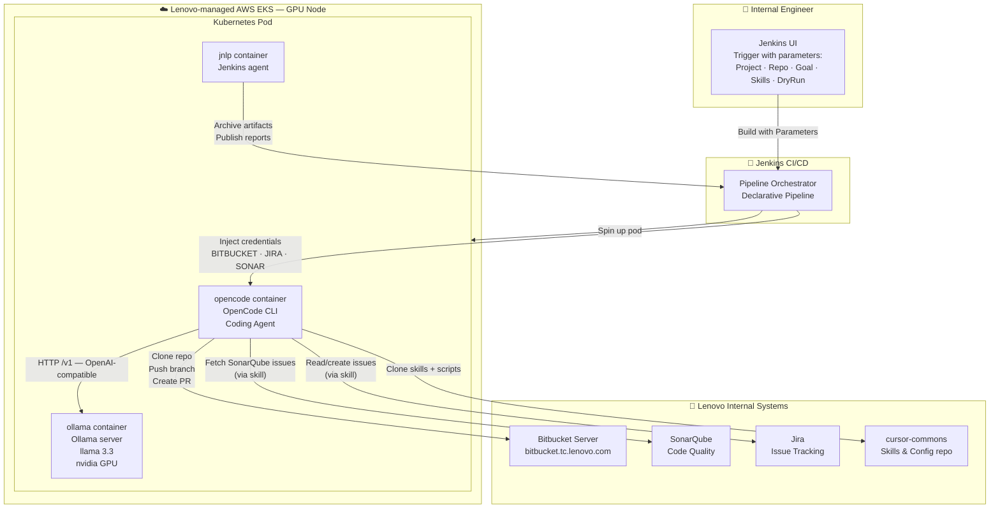
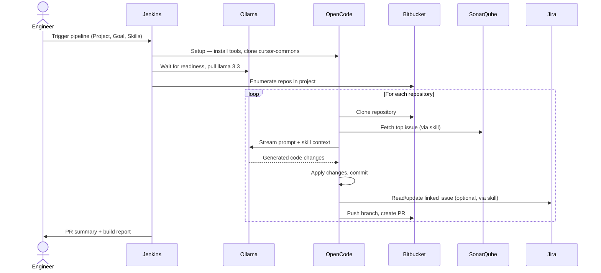
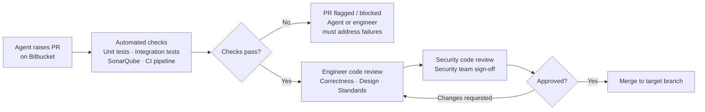

# Coding Agent — Architecture & AI Governance

## Overview

The Coding Agent is an internal automation pipeline that deploys an AI agent to autonomously perform coding tasks (e.g. fix SonarQube findings, apply refactors) across Lenovo Bitbucket repositories. The agent runs inside a Kubernetes pod on Lenovo-managed AWS EKS infrastructure, uses a locally-served LLM via Ollama, and raises pull requests with its changes.

---

## Architecture Diagram

---

## Data Flow — Per Repository

---

## AI Models

| Model | Served By | Approval Status | Geography |
|---|---|---|---|
| **llama 3.3** | Ollama (self-hosted on Lenovo EKS) | ✅ Approved — AI Resource Center | RoW (Rest of World) |

**Notes:**
- The model runs entirely on-premises within the Lenovo EKS GPU node. No prompts, code, or outputs are transmitted to any external AI service.
- OpenCode CLI is used as the agent runtime framework. It communicates with Ollama via a local OpenAI-compatible `/v1` endpoint. No data is sent to OpenCode's cloud.

---

## User Capabilities

| Capability | Description |
|---|---|
| **Targeted repo run** | Run the agent against a single specified repository |
| **Project-wide run** | Run the agent across all repositories in a Bitbucket project |
| **Custom goal** | Specify any natural-language goal (e.g. "Fix the top SonarQube finding") |
| **Skill selection** | Choose which skills (SonarQube, Bitbucket, Jira) to equip the agent with |
| **Dry run mode** | Agent executes but does not push branches or raise PRs |
| **Preflight tests** | Optional: run GPU check and inference benchmarks before the main job |
| **PR summary** | Jenkins build page shows all PRs raised across repos |
| **Metrics reports** | GPU/CPU usage reports published per build (when preflight tests run) |

---

## Customer / User Interface

### Frontend (User Interface)
- **Jenkins parameterised build UI** — the sole interface for triggering runs.
- Parameters: `BITBUCKET_PROJECT`, `BITBUCKET_REPO`, `GOAL`, `SKILLS`, `DRY_RUN`, `RUN_PREFLIGHT_TESTS`.
- No custom web frontend; no end-user-facing application.

### Backend
| Component | Role |
|---|---|
| Jenkins Pipeline | Orchestrates all stages, injects credentials, archives artifacts |
| Kubernetes Pod (EKS) | Isolated execution environment per build; containers share a pod network (localhost) |
| Ollama server | Serves llama 3.3 on the GPU; exposes OpenAI-compatible `/v1` API on `localhost:11434` |
| OpenCode CLI | Agent runtime — receives goal + skill context, calls Ollama, executes tools (file edits, git, API calls) |
| `setup.sh` | Installs system deps, clones cursor-commons, installs OpenCode |
| `enumerate-repos.sh` | Queries Bitbucket REST API to list target repositories |
| `run-harness-on-repo.sh` | Per-repo orchestration: clone → branch → run agent → commit → push → raise PR |
| cursor-commons skills | Markdown skill files injected into the agent prompt (SonarQube, Bitbucket, Jira) |

---

## System Integrations

### Upstream (data flows *into* the agent)

| System | Type | Purpose | Connection |
|---|---|---|---|
| **Bitbucket Server** (`bitbucket.tc.lenovo.com`) | Internal | Source code, repo enumeration | REST API (PAT auth) + git over HTTPS |
| **SonarQube** | Internal | Fetch code quality issues for the agent to fix | REST API (token auth) via `fetch-sonarqube-issues` skill |
| **Jira** | Internal | Read linked issues / acceptance context | REST API (token auth) via `jira` skill |
| **cursor-commons** | Internal Bitbucket repo | Skills (prompt fragments) and helper scripts | git clone over HTTPS |

### Downstream (outputs *from* the agent)

| System | Type | Purpose | Connection |
|---|---|---|---|
| **Bitbucket Server** | Internal | Push agent branches, raise pull requests | git push + REST API (PAT auth) |
| **Jira** | Internal | Update issue status / add comments (optional, via skill) | REST API (token auth) |
| **Jenkins** | Internal | Build reports, artifact archive, HTML metrics | Jenkins pipeline APIs |

---

## Hosting

| Component | Hosted By | Details |
|---|---|---|
| Jenkins CI/CD | **CSW (Lenovo)** | Internal Jenkins instance |
| Kubernetes / EKS | **CSW (Lenovo)** | CSW-managed AWS EKS cluster; GPU node group `lcp-jenkins-gpu-llm` |
| Ollama + LLM model | **CSW (Lenovo)** | Runs inside the EKS pod; model weights cached on node host path (`/mnt/ollama-model-cache`) |
| OpenCode CLI | **CSW (Lenovo)** (self-hosted runtime) | npm package cached on node (`/mnt/npm-global-cache`); runs fully offline — no cloud calls |
| Bitbucket Server | **CSW (Lenovo)** | `bitbucket.tc.lenovo.com` — internal instance |
| SonarQube | **CSW (Lenovo)** | Internal instance |
| Jira | **CSW (Lenovo)** | Internal instance |

**No third-party cloud AI services are used.** All inference is performed on Lenovo-owned GPU hardware. The OpenCode CLI package is sourced from npm at install time but executes entirely locally.

---

## Human in the Loop

The agent is designed to assist, not to replace, human judgment. No agent-generated code is ever merged automatically. Every change raised by the agent must pass through the full review lifecycle before it reaches any branch.

### Review Stages

| Stage | Owner | What is checked |
|---|---|---|
| **Automated tests** | CI pipeline | Unit tests, integration tests, build validation — same gates as any human-authored PR |
| **Static analysis** | SonarQube | Code quality, coverage, known vulnerability patterns |
| **Engineer review** | Repo owner / team | Correctness of the fix, architectural fit, coding standards, unintended side-effects |
| **Security code review** | Security team | Vulnerability assessment, secrets hygiene, dependency risk, secure coding practices |
| **Merge** | Repo owner | Only after all of the above are satisfied |

### Key Principles

- **The agent proposes, humans decide.** The PR is the handoff point — nothing beyond it is automated.
- **Full audit trail.** Every agent commit records the goal, skills used, and model in the commit message, giving reviewers full context.
- **Dry run available.** Engineers can run the pipeline with `DRY_RUN=true` to inspect what the agent would produce without it touching Bitbucket at all.
- **No force-push, no auto-merge.** The agent only pushes a new branch and opens a PR; it has no permissions to merge or bypass branch protection rules.
